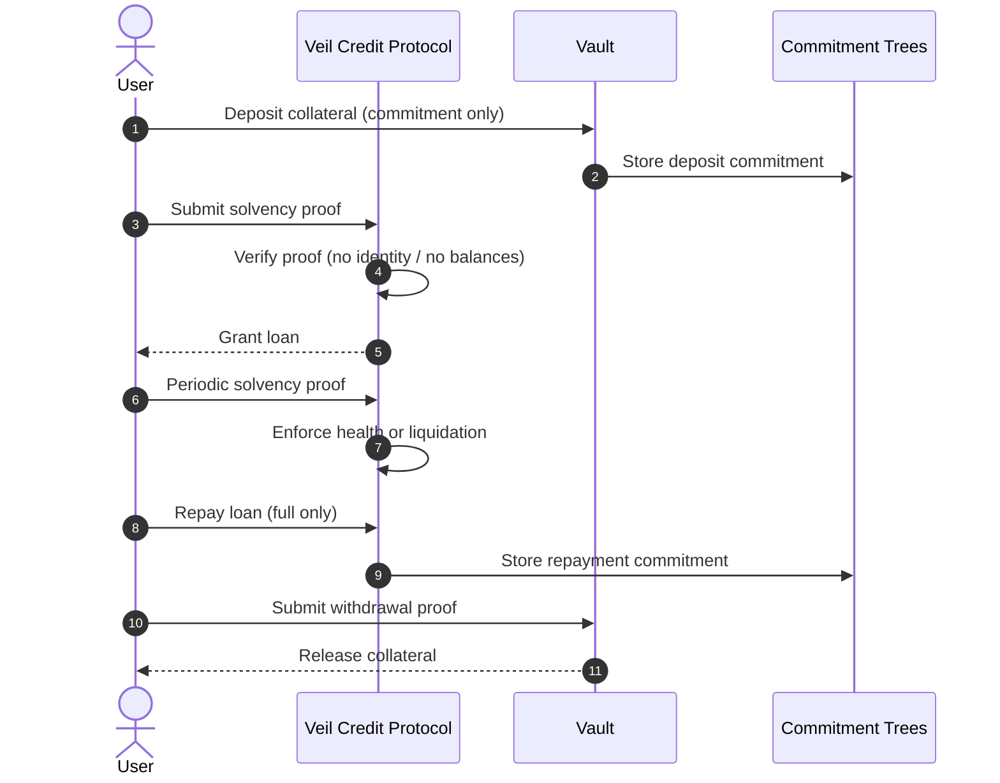
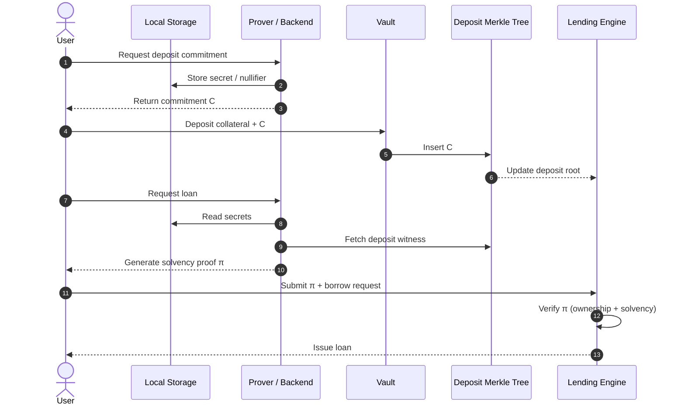
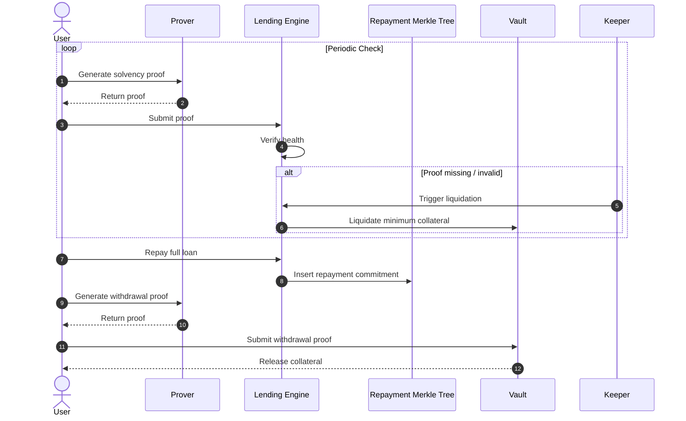

# 🕶️ VeilCredit

> **VeilCredit is a privacy-preserving lending protocol where collateral, solvency, borrowing, repayment, and withdrawal are fully unlinkable on-chain.**

This repository is the **official hackathon collaboration repository** for VeilCredit.

---

## 🧠 Problem

Most on-chain lending protocols publicly expose:

- Collateral amounts  
- Borrower positions  
- Solvency thresholds  
- Repayment behavior  

This results in privacy leakage, strategy extraction, and strong resistance from institutions that require confidentiality.

---

## 💡 Solution

VeilCredit replaces public state disclosure with **zero-knowledge proofs**.

Users never reveal:
- How much collateral they deposited  
- Which lending position they own  
- When they repay  
- Which withdrawal belongs to them  

Instead, users prove **correctness without disclosure**.

---

## 🧩 Core Concept

Protocol rules are enforced using zero-knowledge proofs such as:

- “I own a valid deposit commitment in the Merkle tree”
- “My collateral is sufficient for this borrow amount”
- “I have repaid the loan associated with this nullifier”
- “This withdrawal corresponds to a fully repaid position”

All actions remain unlinkable on-chain.

---

## 🔄 Protocol Flow

Veil Credit is a **privacy-preserving, proof-native lending protocol** where the blockchain never learns who you are, how much collateral you deposited, or your position size.
All lending actions are enforced **solely through cryptographic proofs**.

### Overview

> **The full lending lifecycle, enforced by proofs — not disclosure**

**Key takeaway**

* No balances on-chain
* No identities revealed
* Proofs are the only source of truth

### Deposit & Borrow Flow

> **Private collateral deposit and proof-based borrowing**

**What this enforces**

* Collateral amount is never revealed
* Ownership is proven cryptographically
* Lending rules are enforced without disclosure

### Solvency, Repayment & Withdrawal

> **Ongoing solvency enforcement and private collateral recovery**

**Design choices**

* No partial repayments (simpler state, stronger privacy)
* Collateral withdrawal requires proof of full repayment
* Keepers enforce liveness, not visibility

### 1️⃣ Private Deposit

- User deposits funds into a **Vault** owned by the Lending Engine  
- A **commitment** is generated off-chain  
- The commitment is inserted into a **Deposit Merkle Tree**  
- No on-chain address is linked to the commitment  

---

### 2️⃣ Private Borrow (Solvency Proof)

The user generates a ZK proof that:

- They own a commitment in the deposit Merkle tree  
- Their collateral satisfies protocol solvency constraints  
- The requested borrow amount is valid  

✅ Loan is issued  
❌ Collateral amount and identity remain hidden  

---

### 3️⃣ Periodic Solvency Proofs

- Borrowers must periodically submit a **solvency proof**  
- The proof asserts that the position remains healthy  

Failure to submit a proof within the required interval results in **default**, enforced by protocol rules.

---

### 4️⃣ Private Repayment

- The loan is repaid by sending the **full loan amount associated with a nullifier hash**
- **No zero-knowledge proof is generated during repayment**
- Anyone can repay the loan on-chain, as long as the repayment corresponds to the correct nullifier

This design ensures:
- Repayment is unlinkable to the borrower
- Repayment does not reveal ownership of the position
- Repayment cannot be traced back to the original deposit or borrow

---

### 5️⃣ Private Withdrawal (Post-Repayment Proof)

- After the loan has been fully repaid on-chain
- The user generates a **zero-knowledge proof** that:
  - The loan associated with their commitment and nullifier has been repaid
- Upon successful verification, collateral is withdrawn from the Vault

Withdrawals remain unlinkable to deposits, borrows, and repayments.

## 🔐 Privacy Guarantees

✔ Deposits are unlinkable  
✔ Borrow positions are hidden  
✔ Solvency is proven without disclosure  
✔ Repayment does not expose identity  
✔ Withdrawals cannot be traced back  
✔ Anyone watching the vault can only see the person deposited and withdrawed and its not linkable 

---

## 🏗️ Repository Structure
/contracts     → Solidity smart contracts
/circuits      → Noir zero-knowledge circuits
/frontend      → Frontend application
/docs          → Architecture & protocol documentation

---

## 🎨 Frontend Developer Guide

The frontend **never manages secrets on-chain**.

### Frontend Responsibilities

- Wallet connection  
- Local commitment storage  
- Zero-knowledge proof generation using Noir tooling  
- Submitting proofs and calldata to contracts  
- UX for proof status, deadlines, and protocol state  

---

### Required User Flows

#### Deposit

- User inputs deposit amount  
- Frontend generates a commitment  
- Transaction inserts commitment into Merkle tree  
- Commitment is stored locally  

---

#### Borrow

- User selects borrow amount  
- Frontend generates a solvency proof  
- Proof is submitted to the Lending Engine  

---

#### Periodic Solvency Check

- Time-based reminder UI  
- Frontend generates solvency proof  
- Proof must be submitted before the deadline  

---

#### Repayment

- User repays the loan amount  
- No proof geneation required
---

#### Withdrawal

- Frontend generates a withdrawal proof  
- Proof is submitted to the Vault  
- Collateral is withdrawn   

---

## 🧪 Tech Stack

- **Solidity** – core smart contracts  
- **Noir** – zero-knowledge circuits  
- **Merkle Trees** – commitment tracking  
- **Foundry** – testing and deployment  
- **Frontend** – React / Next.js (TBD)  

---

## 🏁 Hackathon Notes

- This repository represents the **collaborative hackathon version**  
- Core protocol and ZK design were implemented independently and extended here  
- Focus: **privacy-first, institutional-grade lending primitives**  

---

## ⚠️ Disclaimer

This project is a **hackathon prototype** and has not been audited.  
Do not use in production.

---

