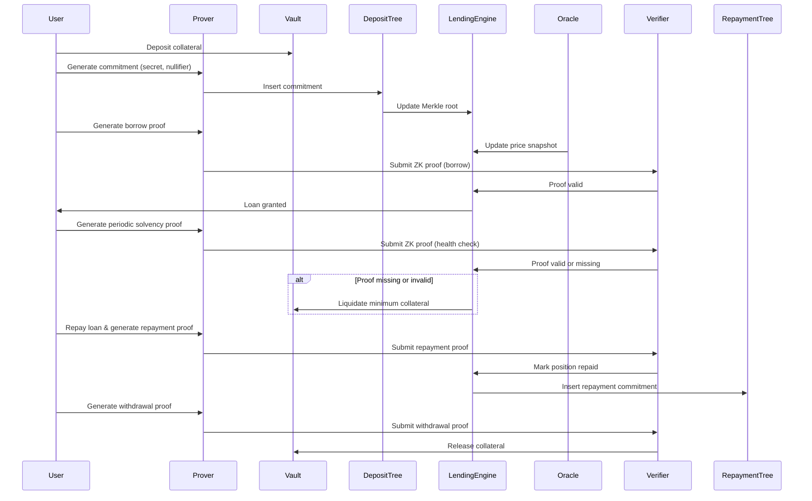

# Veil Credit

**Zero-Knowledge Native Private Lending Protocol**

Veil Credit is a privacy-first on-chain lending protocol that enables users to borrow, repay, and manage credit positions without revealing their identity, balances, or collateral amounts.

Instead of exposing financial data to the blockchain, Veil Credit enforces all lending rules using zero-knowledge proofs.
The protocol verifies *validity*, not *visibility*.

## Motivation

DeFi lending today is transparent by default.

Every interaction publicly exposes:

* Borrower wallet identity
* Collateral size and composition
* Borrowing and repayment behavior
* Liquidation events

This creates systemic problems:

* Wallet surveillance and financial profiling
* MEV-driven and targeted liquidations
* Permanent linkage between identity and credit behavior

While transparency is useful for verification, it is fundamentally incompatible with private credit.

Veil Credit is built on a simple principle:

**Credit should be enforceable without being observable.**

## What Veil Credit Solves

Veil Credit removes data exposure from lending while preserving full protocol safety.

The protocol:

* Does not store user identities
* Does not expose balances or positions
* Does not link deposits to withdrawals
* Does not rely on trusted intermediaries

All interactions are authorized using cryptographic proofs instead of public state.

## Core Idea

Smart contracts do not need private data.

They only need a cryptographic answer to one question:

**“Is this action allowed under the protocol rules right now?”**

Zero-knowledge proofs allow users to prove eligibility without revealing:

* Identity
* Balance
* Exact collateral amount

Veil Credit is designed entirely around this idea.

## How Veil Credit Works

### 1. Collateral Commitment

Users deposit collateral into a vault controlled by the protocol.

Off-chain, the user generates:

* A secret
* A nullifier
* A cryptographic commitment derived from both

Only the commitment is submitted on-chain and inserted into a Merkle tree.
No balance or ownership information is revealed.

### 2. Borrowing via Proof

To borrow, the user generates a zero-knowledge proof that demonstrates:

* A valid commitment exists in the deposit Merkle tree
* The collateral backing the commitment is sufficient
* The position is solvent under current price conditions

The proof references on-chain price snapshots but does not reveal amounts.

If the proof is valid, the lending engine grants the loan.

### 3. Periodic Solvency Proofs

To maintain the position, users must periodically submit proofs of solvency.

Each proof demonstrates:

* Continued control of the commitment
* Continued solvency under updated market prices

Failure to submit a valid proof within the required interval results in liquidation of the minimum collateral required to cover the loan.

### 4. Repayment and Withdrawal

Loans must be repaid in full (partial repayments are not supported).

After full repayment:

* A repayment commitment is generated
* Inserted into a separate repayment Merkle tree

The user then submits a withdrawal proof showing:

* The loan was fully repaid
* The nullifier has not been used

Upon verification, the vault releases the collateral.

## Architecture Overview

Veil Credit separates custody, proof generation, and rule enforcement to maintain privacy by design.

Key components:

* Collateral Vault
* Lending Engine
* Deposit Merkle Tree
* Repayment Merkle Tree
* ZK Prover (off-chain)
* On-chain Verifiers
* Price Oracle & Keepers

## Architecture Flow (Mermaid Sequence Diagram)

## Privacy Model

Veil Credit provides protocol-level privacy, but correct user behavior is required.

The protocol hides:

* Identity
* Balances
* Deposit–borrow linkage

Privacy can be weakened if users reuse wallets or nullifiers.

The protocol does not provide native relayers by default.

Loss of secrets or nullifiers results in permanent loss of access to funds.
There is no recovery mechanism.

## Key Features

* Zero-knowledge native lending
* Proof-based borrowing and liquidation
* Wallet-agnostic interactions
* Oracle-driven but trust-minimized pricing
* Modular architecture for future private assets

## Current Status

Veil Credit was built as part of a hackathon project.

Current implementation includes:

* Private collateral commitments
* ZK-based solvency enforcement
* Proof-verified borrowing and repayment
* Deterministic liquidation logic

Planned extensions:

* Cryptographic oracle attestations
* Abstracted real-world asset representations
* Native relayer integration

## Vision

Veil Credit aims to become the privacy layer for on-chain credit.

A future where:

* Credit is private by default
* Enforcement is trustless
* Financial behavior is not publicly exposed

## One-Line Summary

**Veil Credit enables private, trustless on-chain credit by replacing data with cryptographic proofs.**
